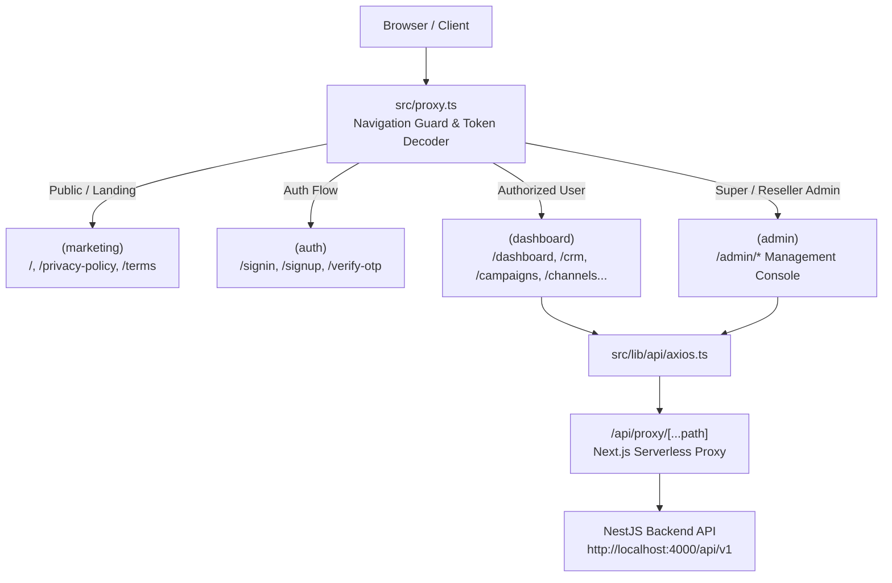

# Appnix SaaS — Next.js 16 Enterprise Frontend

[](https://nextjs.org/)
[](https://react.dev/)
[](https://tailwindcss.com/)
[](https://www.typescriptlang.org/)
[](https://tanstack.com/query)
[](https://zustand-demo.pmnd.rs/)

A modern, high-performance, white-label Next.js 16 (React 19) frontend application for the **Appnix Unified Omnichannel Business Messaging & Marketing Platform** — supporting WhatsApp Business Cloud API, Google RCS, Instagram Direct, and Facebook Messenger marketing.

---

## Table of Contents

1. [Architectural Overview](#architectural-overview)
2. [Tech Stack & Dependencies](#tech-stack--dependencies)
3. [Project Directory Structure](#project-directory-structure)
4. [Route Groups & Layouts](#route-groups--layouts)
5. [End-to-End Frontend Workflows](#end-to-end-frontend-workflows)
   - [1. Marketing Landing Page & Lead Conversion](#1-marketing-landing-page--lead-conversion)
   - [2. Authentication, Session Cookies & Google OAuth](#2-authentication-session-cookies--google-oauth)
   - [3. Dashboard Shell & Collapsible Navigation](#3-dashboard-shell--collapsible-navigation)
   - [4. Broadcast Campaign Wizard (7-Step Guided Pipeline)](#4-broadcast-campaign-wizard-7-step-guided-pipeline)
   - [5. Omnichannel Live Chat & 24h Care Window Inbox](#5-omnichannel-live-chat--24h-care-window-inbox)
   - [6. WhatsApp Cloud API Embedded Signup & Onboarding](#6-whatsapp-cloud-api-embedded-signup--onboarding)
   - [7. RCS Business Messaging Rich Template Designer](#7-rcs-business-messaging-rich-template-designer)
   - [8. CRM Contacts, Bulk CSV Ingestion & Dynamic SuperFields](#8-crm-contacts-bulk-csv-ingestion--dynamic-superfields)
   - [9. Visual Workflow Canvas & Automation Builder](#9-visual-workflow-canvas--automation-builder)
   - [10. Key-Value DataStore & 3rd-Party App Credentials](#10-key-value-datastore--3rd-party-app-credentials)
   - [11. Workspace Billing, Cashfree Drop-in & Wallet Credits](#11-workspace-billing-cashfree-drop-in--wallet-credits)
   - [12. Embeddable Chat Widget Configurator](#12-embeddable-chat-widget-configurator)
   - [13. Super Admin & Reseller Management Console](#13-super-admin--reseller-management-console)
6. [Navigation Middleware & Route Protection (`proxy.ts`)](#navigation-middleware--route-protection-proxyts)
7. [API Layer, Axios Client & Serverless Proxy](#api-layer-axios-client--serverless-proxy)
8. [State Management Strategy](#state-management-strategy)
9. [Theming & Component Design System](#theming--component-design-system)
10. [Configuration & Environment Variables](#configuration--environment-variables)
11. [Local Development & Validation](#local-development--validation)
12. [Production Build & Container Deployment](#production-build--container-deployment)
13. [Troubleshooting Common Issues](#troubleshooting-common-issues)

---

## Architectural Overview

The Appnix frontend is built on **Next.js 16** with the **App Router**, taking full advantage of React Server Components (RSC) for lightning-fast initial load times alongside interactive client components for complex canvas workflows and real-time chat.



---

## Tech Stack & Dependencies

| Category | Technology | Version | Description |
|----------|------------|---------|-------------|
| **Framework** | Next.js (App Router, Turbopack) | 16.3.0 | Modern hybrid server/client framework |
| **Runtime** | React / React DOM | 19.2.8 | Latest concurrent React features |
| **Language** | TypeScript (Strict Mode) | 5.x | End-to-end type safety |
| **Styling** | Tailwind CSS & CSS Variables | 4.x | Utility-first styling with theme variables |
| **UI Primitives** | Radix UI Primitives | Latest | Accessible unstyled primitives |
| **Component Kit** | shadcn/ui (`base-nova`) | Latest | Pre-styled accessible components |
| **Server State** | TanStack React Query | 5.101.4 | Caching, deduplication, and optimistic updates |
| **Client State** | Zustand | 5.0.14 | Global UI and campaign wizard state |
| **Forms** | React Hook Form + Zod | 7.85 / 3.25 | High-performance schema-validated forms |
| **Data Visualization** | Recharts | 3.10.1 | Responsive charts and analytics funnels |
| **Icons** | Lucide React | 1.31.0 | SVG icon library |
| **Date Utilities** | date-fns | 4.4.0 | Timezone-aware date calculations |
| **Code Quality** | ESLint 9 (Flat Config) + Husky | 9.x | Pre-commit linting and type verification |

---

## Project Directory Structure

```
frontend/
├── public/                    # Static assets, logos, favicons, OG images
├── src/
│   ├── app/                   # Next.js App Router tree
│   │   ├── (admin)/           # Administrative & Reseller Management Console
│   │   │   └── admin/         # /admin/* routes (dashboard, clients, billing, flags...)
│   │   ├── (auth)/            # Auth routes (/signin, /signup, /verify-otp, /reset-password)
│   │   ├── (dashboard)/       # 40+ authenticated business operations pages
│   │   ├── (marketing)/       # Marketing landing page, legal, terms, privacy
│   │   ├── api/               # Next.js Serverless proxy & webhook routes
│   │   │   ├── proxy/         # /api/proxy/[...path] forwarder to NestJS
│   │   │   ├── leads/         # Landing page lead capture endpoint
│   │   │   └── v1/            # Frontend webhook bridge endpoints
│   │   ├── layout.tsx         # Root layout (Providers, Fonts, Toaster)
│   │   └── globals.css        # Tailwind v4 theme variables & design tokens
│   ├── components/
│   │   ├── campaigns/         # CampaignWizard, steps, test modal, launch modal
│   │   ├── channels/          # ChannelManager and channel onboarding cards
│   │   ├── forms/             # Reusable form controls & field components
│   │   ├── landing/           # 20+ modular landing page sections
│   │   ├── layout/            # AppSidebar, AppNavbar, UserDropdown, WorkspaceSwitcher
│   │   ├── providers.tsx      # QueryProvider, ThemeProvider, AuthProvider
│   │   └── ui/                # 18+ shadcn/ui base primitives (Button, Dialog, etc.)
│   ├── hooks/                 # Custom React hooks (useCampaignWizard, useToast, etc.)
│   ├── lib/
│   │   ├── api/               # Axios instance with 401 refresh interceptors
│   │   ├── auth/              # AuthContext, token management, session state
│   │   ├── config/            # Application config constants & API URLs
│   │   ├── query/             # TanStack Query client configuration
│   │   ├── theme/             # next-themes provider & theme toggler
│   │   └── utils.ts           # Classnames helper cn()
│   ├── proxy.ts               # Route guard middleware & rewrite proxy
│   ├── super-admin/           # Admin console components, services, and types
│   └── types/                 # Global TypeScript interfaces & DTO types
├── components.json            # shadcn/ui configuration
├── tsconfig.json              # Path aliases (@/*, @/components/*, etc.)
└── package.json
```

---

## Route Groups & Layouts

| Route Group | Layout Path | Access Rule | Description |
|-------------|-------------|-------------|-------------|
| `(marketing)` | `src/app/layout.tsx` | Public | Landing page, privacy policy, terms |
| `(auth)` | `src/app/layout.tsx` | Unauthenticated (auto-redirects if logged in) | Sign in, sign up, verify OTP, forgot/reset password |
| `(dashboard)` | `src/app/(dashboard)/layout.tsx` | Authenticated (`appnix_access_token`) | Protected app shell with collapsible sidebar & navbar |
| `(admin)` | `src/app/(admin)/admin/layout.tsx` | Administrative (`SUPER_ADMIN` / `RESELLER_ADMIN`) | Platform administration, client management, telemetry |

---

## End-to-End Frontend Workflows

### 1. Marketing Landing Page & Lead Conversion

- **Route**: `/` (Public)
- **Component**: `src/components/landing/LandingPage.tsx`
- **Sections Flow**:
  1. **Navbar**: Responsive sticky bar with feature links, pricing link, and "Book Demo" CTA.
  2. **Hero**: Headline, live product preview screenshot, dual CTAs ("Start Free Trial", "Schedule Demo").
  3. **TrustMetrics**: Statistics counter (businesses served, messages sent, uptime guarantee).
  4. **ChannelDemo**: Interactive tabs previewing WhatsApp, RCS, Instagram, and Facebook messaging experiences.
  5. **FeatureGrid**: 8 visual feature cards showcasing broadcast campaigns, chatbots, live chat, and CRM.
  6. **HowItWorks**: 3-step visual onboarding guide (Connect -> Build -> Broadcast).
  7. **CRMShowcase**: Visual preview of pipeline management, tags, and custom fields.
  8. **AutomationShowcase**: Interactive workflow canvas preview.
  9. **CampaignShowcase**: Broadcast speed and delivery tracking highlights.
  10. **WhiteLabel**: Dedicated section for agencies and resellers with re-branding options.
  11. **WhyAppnix**: Competitive comparison matrix.
  12. **Testimonials**: Auto-rotating customer feedback carousel.
  13. **PricingPreview**: 3 plan cards (Starter, Pro, Enterprise) with feature checklist and checkout triggers.
  14. **FAQ**: Searchable accordion of frequent questions.
  15. **FinalCTA**: High-impact banner for instant signup.
  16. **Footer**: Navigation links, social channels, and legal policies.
  17. **FloatingLeadTrigger & StickyMobileCTA**: Contextual bottom CTA triggers.
  18. **ExitIntentModal**: Captures departing visitors with promotional offer.
  19. **LeadFormModal**: Validates lead capture data and submits to `POST /api/leads`.

---

### 2. Authentication, Session Cookies & Google OAuth

- **Routes**: `/signin`, `/signup`, `/login`, `/forgot-password`, `/verify-otp`, `/reset-password`
- **User Authentication Flow**:
  1. User fills credentials on `/signin` (with optional "Remember me" extending refresh cookie to 30 days).
  2. Form validates client-side using Zod and submits to `POST /api/proxy/auth/login`.
  3. Backend returns JWT tokens and sets an HttpOnly, SameSite=Lax cookie (`appnix_access_token`).
  4. `AuthContext` mirrors the token in memory and navigates to `/dashboard`.
  5. **Host-Only Session Cookies**: Session tokens omit the wildcard `Domain=.appnix.co.in` attribute (`domain: undefined`), ensuring cookies are host-only. This prevents authentication tokens from bleeding across panels (e.g., between `app.appnix.co.in` and `partners.appnix.co.in`).
  6. **Google OAuth**: Clicking "Sign in with Google" invokes Google One-Tap or redirects to `/api/v1/auth/google`. Upon Google callback, tokens are set, and the browser redirects to `/dashboard`.
  7. **Token Auto-Refresh**: If an API call fails with `401 Unauthorized`, Axios interceptors catch the failure, request a new access token via `/api/proxy/auth/refresh`, and replay the failed request seamlessly.
  8. **Panel Isolation**: Direct Client Workspace (`app.appnix.co.in`) strictly routes authentication and registration flows to the local `/dashboard` without bouncing to partner domains. Reseller Admin credentials attempting to log in on the direct client workspace are blocked with an explicit boundary error.

---

### 3. Dashboard Shell & Collapsible Navigation

- **Layout File**: `src/app/(dashboard)/layout.tsx`
- **Shell Components**:
  - `AppNavbar`: Workspace switcher dropdown, global search trigger (`Ctrl+K` / `Cmd+K`), notification bell with counter, theme toggle, and user profile avatar.
  - `AppSidebar`: Collapsible sidebar persisting collapsed state in `localStorage`. Provides structured navigation to:
    - **Dashboard Overview** (`/dashboard`)
    - **CRM Suite** (`/crm`, `/crm/contacts`, `/crm/live-chat`, `/crm/campaigns`, `/crm/super-fields`)
    - **Broadcasts** (`/crm/campaigns/create`, `/crm/bulk-campaign`)
    - **Automations** (`/automations`, `/automations/workflow`, `/automations/templates`, `/automations/data-store`, `/automations/app-authentications`)
    - **Channels** (`/channels`, `/channels/whatsapp`, `/channels/rcs`, `/channels/instagram`, `/channels/facebook`)
    - **Chatbots & Mini Apps** (`/chatbots`, `/whatsapp-mini-apps`, `/voice-ai-agent`)
    - **Products & Departments** (`/products`, `/department`, `/department/roles`)
    - **Workspace & Settings** (`/workspace/billing`, `/workspace/wallet`, `/workspace/account-settings`, `/settings`)

---

### 4. Broadcast Campaign Wizard (7-Step Guided Pipeline)

- **Route**: `/crm/campaigns/create` (also accessed via `/campaigns/new`)
- **State Store**: `src/hooks/useCampaignWizard.ts` (Zustand with localStorage draft persistence)
- **7 Steps**:
  1. **Campaign Details**: Name, campaign goal, description, and categorization tags.
  2. **Audience Selection**: Target all contacts, saved audience segments, or filtered tags. Fetches live audience count via `GET /api/proxy/audiences`.
  3. **Channel Selection**: Select broadcast medium (WhatsApp, RCS, Instagram, Facebook). Verifies connected channel status.
  4. **Template Selection**: Loads approved message templates for selected channel. Renders dynamic preview.
  5. **Variable Mapping**: Auto-detects placeholders (e.g. `{{1}}`, `{{name}}`) and allows mapping them to contact attributes or static fallbacks.
  6. **Live Preview & Test Send**: Visual message preview with sample contact data. Includes `TestMessageModal` to dispatch an immediate test message to the user's phone.
  7. **Review & Launch**: Displays comprehensive summary (total recipients, estimated cost, template name). Offers options to Save Draft, Schedule for later date, or Launch Immediately with `LaunchConfirmModal`.

---

### 5. Omnichannel Live Chat & 24h Care Window Inbox

- **Route**: `/crm/live-chat`
- **Core Capabilities**:
  - **Thread List**: Filter conversations by channel (WhatsApp, RCS, IG, FB), unread state, or assigned agent.
  - **24-Hour Service Window Indicator**: Live countdown timer badge. When open, free-form text input and media attachments are enabled. When expired, UI warns the agent and defaults to approved WhatsApp template selection.
  - **Internal Collaboration**: "Internal Note" tab allows adding private agent-only notes that customer cannot see.
  - **Customer Profile Sidebar**: Live editing of contact details, SuperFields, lead stage, and sentiment remarks.

---

### 6. WhatsApp Cloud API Embedded Signup & Onboarding

- **Route**: `/channels/whatsapp`
- **Features**:
  - **Embedded Signup Popup**: Triggers Meta FB.login popup with `whatsapp_business_messaging` permissions.
  - **WABA Health Dashboard**: Displays verified display name, phone number ID, quality rating, and messaging tier limits.
  - **Template Synchronizer**: Button to sync templates from Meta Graph API in real-time.
  - **Webhook Status**: Verifies webhook URL and challenge token configuration.

---

### 7. RCS Business Messaging Rich Template Designer

- **Route**: `/channels/rcs`
- **Capabilities**:
  - Design Text messages, Rich Cards (media, title, subtitle, suggestion action chips), and Carousels (up to 10 rich cards).
  - Configure action chips: Open URL, Dial Phone Number, View Location, and Predefined Postbacks.
  - Track carrier review status across telecom operators.

---

### 8. CRM Contacts, Bulk CSV Ingestion & Dynamic SuperFields

- **Routes**: `/crm/contacts`, `/crm/super-fields`
- **Features**:
  - **Contact Directory**: Search, filter by department, tag, or custom SuperFields.
  - **CSV Ingestion Modal**: Drag-and-drop CSV file, auto-detect columns, preview sample rows, and choose duplicate strategy (Skip, Overwrite, Reject).
  - **SuperFields Manager**: Create custom dynamic attributes (e.g., "Loyalty Tier", "Contract Value") with custom data types and UI placements.

---

### 9. Visual Workflow Canvas & Automation Builder

- **Route**: `/automations/workflow`
- **Capabilities**:
  - Drag-and-drop node graph canvas (Trigger Nodes, Message Nodes, Condition Nodes, DataStore Nodes, 3rd-Party App Nodes).
  - Connect node ports to define execution logic.
  - Save, version, and test-run workflows with simulated payloads.

---

### 10. Key-Value DataStore & 3rd-Party App Credentials

- **Routes**: `/automations/data-store`, `/automations/app-authentications`
- **DataStore**: Create key-value document stores for workflows with optional TTL expiration.
- **App Credentials**: Connect and test live credentials for Shopify, OpenAI, Cashfree, HubSpot, and Webhooks.

---

### 11. Workspace Billing, Cashfree Drop-in & Wallet Ledger

- **Routes**: `/workspace/billing`, `/workspace/wallet`
- **Subscription Upgrades**:
  - View current plan quotas (monthly messages, bot flows, team seats).
  - Selecting an upgraded plan initializes a Cashfree checkout session (`POST /api/proxy/billing/checkout`).
  - Opens Cashfree Drop-in UI for instantaneous UPI / Card / NetBanking payment.
- **Message Wallet**:
  - View live INR balance and spend ledger.
  - Instant top-up modal and automatic recharge threshold settings.

---

### 12. Embeddable Chat Widget Configurator

- **Route**: `/chat-widget`
- **Features**:
  - Customize widget branding: brand colors, position (bottom-right / bottom-left), avatar, welcome greetings.
  - Multi-channel routing: WhatsApp, Web Chat, Messenger, Instagram.
  - Copy-paste script tag snippet generator for external websites with live preview iframe.

---

### 13. Super Admin & Reseller Management Console

- **Route**: `/admin/*` (accessible by `SUPER_ADMIN` and `RESELLER_ADMIN` roles)
- **Console Pages**:
  - `/admin/dashboard`: Platform throughput, revenue metrics, active tenants.
  - `/admin/clients`: Onboard new clients, assign plans, suspend tenants, verify custom domains. Includes top-level sub-tabs for All Clients vs Inside Clients.
  - `/admin/clients/inside-clients`: Dedicated console for proprietary inside clients provisioned directly on `app.` and `admin.` subdomains under Platform Root, strictly segregated from third-party resellers.
  - `/admin/team`: Manage staff members and assign administrative roles.
  - `/admin/billing`: Platform-wide transaction audit and payout reconciliation.
  - `/admin/feature-flags`: Enable/disable features globally or for individual tenants.
  - `/admin/system-health`: API latency telemetry and server health status.
  - `/admin/support`: Universal support ticket resolution desk.
  - `/admin/settings`: Global rate limits and maintenance toggles.
  - `/admin/audit-logs`: Immutable platform action audit logs.

---

## Navigation Middleware & Route Protection (`proxy.ts`)

Navigation protection and route gatekeeping is handled in `src/proxy.ts`:

1. **Path Normalization & Aliases**:
   - `/app` or `/app/*` -> Redirects to `/dashboard` or `/dashboard/*`
   - `/super-admin` or `/super-admin/*` -> Redirects to `/admin` or `/admin/*`
   - `/login` and `/auth/login` -> Rewrites/redirects to `/signin`
   - `/register` and `/auth/register` -> Rewrites/redirects to `/signup`
2. **Domain-Aware Routing (`isAppSubdomain`)**:
   - On `app.appnix.co.in` (and `app.localhost`), root `/` rewrites directly to `/dashboard`.
   - Dedicated signin and signup routes preserve the app panel context and eliminate cross-domain bounces to `partners.appnix.co.in`.
   - Access attempts to `/admin` on the app portal redirect cleanly to `/dashboard` with no partner portal leakage.
3. **Cookie-Based Token Decoding**:
   - Extracts `appnix_access_token` from cookies.
   - Decodes JWT payload to inspect `sub`, `role`, and `tenantId`.
4. **Admin Gatekeeping (`/admin/*`)**:
   - Unauthenticated visitors are redirected to `/admin/login?returnUrl=...`.
   - Authenticated non-admin users are redirected to `/dashboard`.
5. **Client Dashboard Gatekeeping (`/dashboard/*`, `/crm/*`, `/campaigns/*`, etc.)**:
   - Unauthenticated visitors are redirected to `/signin?returnUrl=...`.
6. **Auth Route Bypassing (`/signin`, `/signup`)**:
   - Already authenticated users are forwarded directly to their respective workspaces (`/admin/dashboard` or `/dashboard`).

---

## API Layer, Axios Client & Serverless Proxy

All frontend API calls communicate through the central Axios instance (`src/lib/api/axios.ts`):

- **Target Route**: By default targets `/api/proxy/[...path]` in the Next.js App Router.
- **Serverless Proxy Forwarding**: `src/app/api/proxy/[...path]/route.ts` proxies requests to the NestJS backend (`http://localhost:4000/api/v1`), forwarding incoming headers, cookies, and payloads while adding `x-forwarded-proto` and `x-forwarded-for`.
- **Axios Interceptors**:
  - **Request Interceptor**: Attaches `Authorization: Bearer <token>` and `X-Tenant-Id` headers.
  - **Response Interceptor**: Intercepts `401 Unauthorized`, initiates a single token refresh request via `/api/proxy/auth/refresh`, and replays queued requests automatically.

---

## State Management Strategy

| Scope | Library | Usage |
|-------|---------|-------|
| **Server State & Cache** | TanStack Query v5 | API queries, mutations, deduplication, cache invalidation |
| **Campaign Wizard State** | Zustand (`useCampaignWizard`) | 7-step wizard draft state, variable mappings, draft persistence |
| **Authentication State** | React Context (`AuthContext`) | Active user object, login, logout, token refresh |
| **Theme State** | `next-themes` (`ThemeProvider`) | Light, dark, and system theme persistence |
| **Form State** | React Hook Form + Zod Resolver | Step-by-step form validation and error handling |

---

## Theming & Component Design System

- **Tailwind CSS v4**: High-performance engine configured with modern CSS variables in `src/app/globals.css`.
- **Color Palettes**: Neutral base with CSS variable overrides for `--background`, `--foreground`, `--primary`, `--primary-foreground`, `--muted`, `--accent`, and `--border`.
- **System / Light / Dark Mode**: Toggled via `useTheme()` from `next-themes`. No flash during SSR hydration.
- **shadcn/ui Primitives**: Installed under `src/components/ui/` using the `base-nova` neutral style preset.

---

## Configuration & Environment Variables

Create `.env.local` in the `frontend/` root directory:

```env
# Public Website & Application Canonical URLs
NEXT_PUBLIC_APP_URL=http://localhost:3000
NEXT_PUBLIC_SITE_URL=http://localhost:3000

# Backend NestJS Engine Base URL
NEXT_PUBLIC_API_BASE_URL=http://localhost:4000/api/v1

# Google OAuth 2.0 Client ID (for Google One-Tap & Sign-In)
NEXT_PUBLIC_GOOGLE_CLIENT_ID=your_google_client_id.apps.googleusercontent.com

# Google reCAPTCHA v3 Site Key
NEXT_PUBLIC_RECAPTCHA_SITE_KEY=your_recaptcha_site_key
```

---

## Local Development & Validation

### Install Dependencies
```bash
cd frontend
npm install
```

### Start Development Server
```bash
npm run dev
```
*Runs at `http://localhost:3000` with Turbopack fast refresh.*

### Code Quality & Validation
```bash
# TypeScript compiler check without emitting files
npm run type-check

# ESLint flat configuration check
npm run lint

# Comprehensive build validation
npm run validate
```

---

## Production Build & Container Deployment

### Local Production Build
```bash
npm run build
npm run start
```

### Docker Containerization
```dockerfile
FROM node:20-alpine AS builder
WORKDIR /app
COPY package*.json ./
RUN npm ci
COPY . .
RUN npm run build

FROM node:20-alpine AS runner
WORKDIR /app
ENV NODE_ENV=production
COPY --from=builder /app/public ./public
COPY --from=builder /app/.next/standalone ./
COPY --from=builder /app/.next/static ./.next/static
EXPOSE 3000
CMD ["node", "server.js"]
```

---

## Troubleshooting Common Issues

| Symptom | Root Cause | Resolution |
|---------|------------|------------|
| **Hydration mismatch error** | SSR rendering differs from browser theme or missing `suppressHydrationWarning` | Ensure `suppressHydrationWarning` is present on the root `<html>` element in `src/app/layout.tsx`. |
| **401 Unauthorized Redirect Loop** | Expired refresh cookie or mismatched API base URL | Clear browser cookies for `localhost`, verify `NEXT_PUBLIC_API_BASE_URL`, and restart development server. |
| **API Proxy returns 502 Bad Gateway** | NestJS backend is offline or unreachable on port 4000 | Verify the backend process is active (`npm run start:dev` inside `/backend`). |
| **Styles or Tailwind utilities missing** | Tailwind CSS v4 import path issue | Ensure `@import "tailwindcss";` is present at the top of `src/app/globals.css`. |
| **Cashfree SDK fails to mount** | Sandbox mode vs production credentials mismatch | Ensure `CASHFREE_MODE=sandbox` is configured on the backend when testing sandbox credentials. |

---

## License

Proprietary Software — Copyright © 2026 Appnix Technologies Pvt. Ltd. All Rights Reserved.
